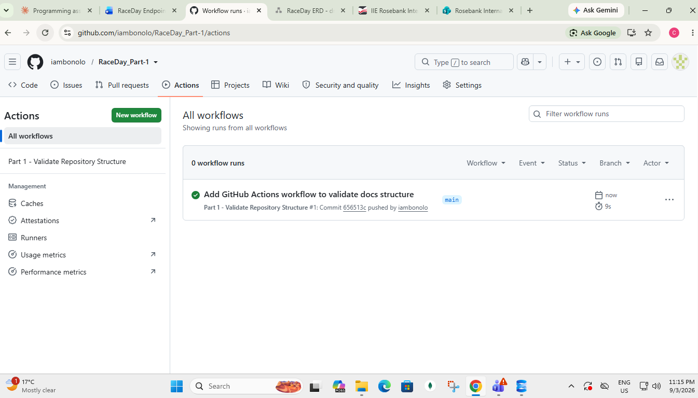

# RaceDay — Part 1: System Planning

## System Description

RaceDay is a full-stack, web-based event management system built for the South African road running, walking, and cycling community. The platform replaces the paper-based registration, spreadsheets, and disconnected communication that many local race organisers currently rely on.

Event Organisers can create and manage events, define age/distance categories, and capture participant results. Participants can browse upcoming events, enter events by selecting a category, track their enrolment status, and view their personal race history once results are published.

This part of the project (Part 1) covers the planning phase only — no application code has been written. The deliverables are an Entity Relationship Diagram (ERD), a full API endpoint plan, and a SQL Server database script that creates and seeds the schema.

## User Roles

**Organiser**
- Creates, edits, and deletes events
- Manages age/distance categories for their events
- Views all enrolments for events they manage
- Captures finish times and finishing positions for participants after an event

**Participant**
- Registers for an account and logs in
- Browses upcoming events and available categories
- Enters an event by selecting a category
- Views their own enrolment status
- Tracks their personal race history and results once published

## Repository Structure

## Setup Instructions (Part 1)

1. Install SQL Server (Express or Developer edition) and SQL Server Management Studio (SSMS)
2. Open SSMS and connect to your local server instance
3. Open a new query window
4. Open `/docs/RaceDay Schema.sql`, copy its full contents, and paste into the query window
5. Execute the script (F5) — this creates the `RaceDayDB` database, all 6 tables, and seeds sample data
6. Confirm success via the Messages tab and by expanding `RaceDayDB > Tables` in Object Explorer

## CI/CD

 

## Video Walkthrough

<!-- Insert unlisted YouTube link here — walkthrough of ERD decisions, endpoint plan choices, and the SQL script running live in SSMS -->
